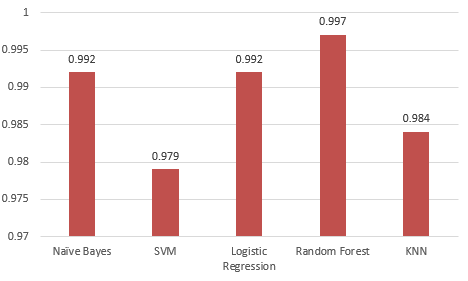

# Development of Feature Selection Algorithm for Early Prediction of Cancer
A research-based final year project that aims to evaluate the potential of filter-based and wrapper-based feature selection methods (i.e.m Information Gain-Based Feature Selection and Learner-Based Feature Selection) on breast cancer prediction.

## Overview
This repository contains the materials and findings from my final year project, which focuses on developing a feature selection algorithm for the early prediction of cancer. The study uses the WDBC dataset and evaluates feature selection methods in Weka such as InfoGain and WrapperSubset with classification models (e.g., KNN, Logistic Regression, Naïve Bayes, SVM, Random Forest). The performance of each classifier is tested using performance metrics such as accuracy and AUC (area under the ROC curve). 

## Research Tools
- **Jupyter Notebook**: Used to perform data cleaning and data visualisation.
- **Weka**: Used to perform data preprocessing (i.e., data normalisation and data balancing), feature selection, splitting of dataset, classification and performance evaluation. 

## Files and Folders
- **wdbc.csv**: Wisconsin Diagnostic Breast Cancer (WDBC) dataset from the University of California - Irvine machine learning repository as the input dataset in this project.
- **Data-Visualisation.ipynb**: Jupyter Notebook for initial data visualization and exploration.
- **Weka Files**:
  - `Classification/`: Contains classification results for different models and feature selection methods.
  - `Feature-Selection/`: Contains feature selection results tested with different models.

## Key Highlights
- Implemented and evaluated feature selection techniques (InfoGain, WrapperSubset).
- Tested with classification models: KNN, Logistic Regression, Naïve Bayes, SVM, and Random Forest.
- Insights into how feature selection improves model accuracy and reduces computation time.
- Insights gained through parameter tuning highlight opportunities for further optimization of classification models.

## Workflow Overview
The following flowcharts illustrates each phase of the proposed workflow in this project: 

### 1. Information Gain-Based Feature Selection

### 2. Learner-Based Feature Selection

## Results Overview  

### Accuracy
Accuracy determines the percentage of correct prediction of a model affected by the process of feature selection. The tables below compares the performance of various models in classification before and after parameter tuning for both Information Gain-Based and Learner-Based feature selection methods. 

#### 1. Information Gain-Based Feature Selection
| Model               | Parameter Tuning                 | Accuracy Before Parameter Tuning (%) | Accuracy After Parameter Tuning (%) |
|---------------------|--------------------------------- |--------------------------------------|-------------------------------------|
| Naïve Bayes         | useKernelEstimator=True          | 93.42                                | 94.82                               |
| SVM                 | Kernel=RBFKernel, gamma=10,15,20 | 95.38                                | 97.90, gamma=15                     |
| Logistic Regression | ridge=1.0, 0.1, 0.01             | 95.38                                | 96.36, ridge=0.01                   |
| Random Forest       | numIterations=50                 | 98.74                                | 98.60                               |
| KNN                 | k=3,7                            | 97.62                                | 97.06, k=3                          |

#### 2. Learner-Based Feature Selection
| Model               | Parameter Tuning                 | Accuracy Before Parameter Tuning (%) | Accuracy After Parameter Tuning (%) |
|---------------------|--------------------------------- |--------------------------------------|-------------------------------------|
| Naïve Bayes         | useKernelEstimator=True          | 97.06                                | 96.36                               |
| SVM                 | Kernel=RBFKernel, gamma=10,15,20 | 97.90                                | 97.96, gamma=20                     |
| Logistic Regression | ridge=1.0, 0.1, 0.01             | 98.04                                | 97.90, ridge=0.01                   |
| Random Forest       | numIterations=50                 | 99.02                                | 98.74                               |
| KNN                 | k=3,7                            | 98.46                                | 97.34, k=3                          |

### AUC rates
AUC rates determines the capability of a model in class separation by distinguishing between malignant patients and benign patients in early prediction of breast cancer. The bar chart belows illustrates the AUC rates for different models in both Information Gain-Based and Learner-Based feature selection methods.

### 1. Information Gain-Based Feature Selection

### 2. Learner-Based Feature Selection

## How to Use
1. Clone the repository: `git clone <repository-link>`
2. Open `Data-Visualisation.ipynb` to explore the initial analysis.
3. Navigate to `Weka Files/` to view classification and feature selection results.
